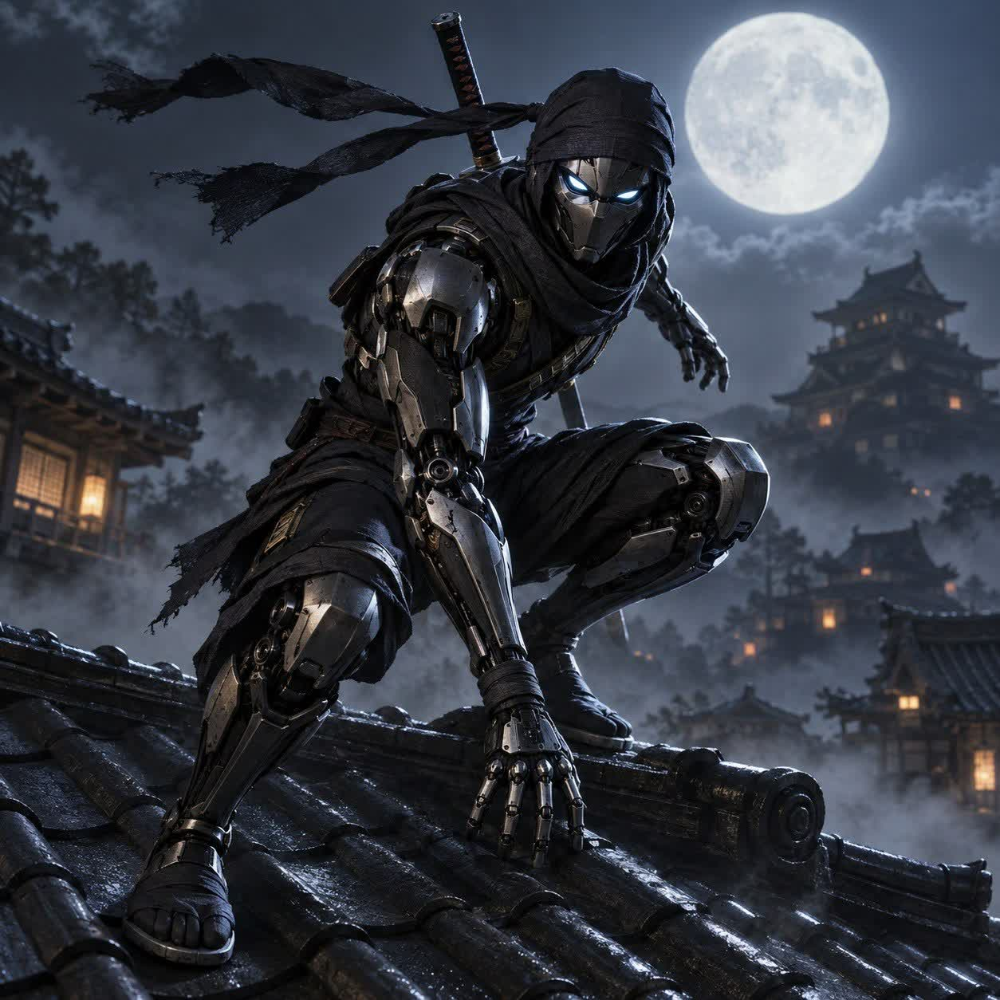

# Kagebot · Rooftop Run

[Play the browser preview](https://geekkingcloud.github.io/dantes-secret-mission/)

*Original character reference above; the current playtest uses provisional, lean canvas-rendered artwork. This is one rooftop section, not the completed World 1 campaign.*

A self-contained, playable preview of **Kagebot's Secret Mission**. Open `index.html` through any static HTTP server; no build, login, key or network dependency. For example, from this folder: `python3 -m http.server 8000`. The broader campaign is preserved in [GAME-DESIGN.md](GAME-DESIGN.md), not presented as unfinished menus.

**Controls:** A/D or ←/→ move; W/↑ climb full-height walls; Space jump, jump again for a frontflip, or wall-jump; J sword (three-hit sequence); K dash (brief invulnerability, cooldown); L limited laser; F finish a one-health mutant from behind and refund one laser charge; Esc/P pause. Standard Xbox/PlayStation mapping: left stick/D-pad move and climb, A/Cross jump, X/Square sword, B/Circle dash, Y/Triangle laser, RB/R1 finisher, Menu/Options pause. Touch controls appear on small/coarse screens. Four integrity units; nonlethal pits recover at the last roof checkpoint, while defeat restarts the **section start** with full health and ammo and no retry limit.

**Art direction:** custom canvas silhouettes, long articulated robot limbs, dark hood and sparse cyan visor/scarf, in layered moonlit temple roofs and plaster/wood architecture. A local lean pixel-art run pilot was reviewed but not shipped: its later frames drift upright, foot contacts wander, and its seam jumps. This build keeps one coherent authored vector/pixel direction across all actions and the mutant instead of mixing that incomplete loop with unrelated poses. Collision, hurt and slash geometry are fixed in `physics.mjs`, independent of the drawings.

**Audio:** approved rooftop music and selected original heavy SFX are local WAV files. Web Audio starts on gesture, decodes once, keeps at most one music loop, limits output, and suspends on mute, pause and hidden tab. Fonts are local with bundled OFL licenses. `preview.png` is a real Chromium gameplay screenshot.

**Verification:** `node --test tests/*.test.mjs` covers input-only section completion, wall contact/climb below a lip, jump/frontflip/dash, multi-hit combo/behind-only finisher and ammo cap, lethal spike/pit section reset, nonlethal pit checkpoint recovery, 240Hz input queuing and simulated standard gamepad edges. Chromium confirmed keyboard begin/pause/resume, simulated standard-pad A begin and Menu/A pause-resume, local WAV requests and queued high-refresh edges. A physical controller has **not** been tested.
